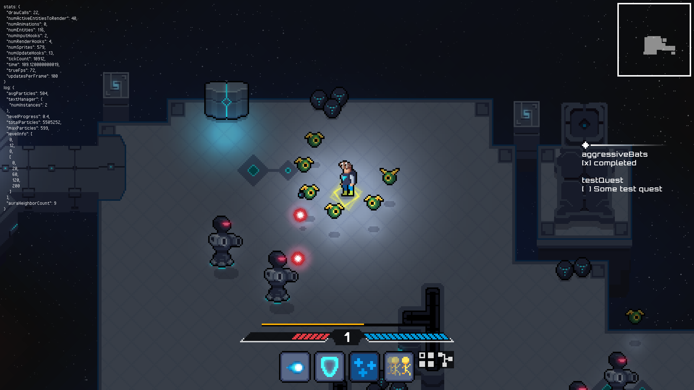

# Name of game TBD

This is an action role playing game set in a sci-fi universe. The core game loop revolves around the idea of destroying enemies, collecting loot and building skills to get stronger.

## Playing the game

*Note: Currently, the game only supports Windows.*

Double-click `./bin/game.exe` in the Windows explorer.

## Architecture

* Programming language - [Haxe](https://haxe.org/)
* Game Engine - [Heaps](https://heaps.io/)

## Third-party applications

* Pixel Art - [Aseprite](https://www.aseprite.org/)

## Build and compile

### Dev server

This will build all assets (art, maps, sprite sheets) and then compile the game.

`npm start`

### Production build

`npm run productionBuild`

## Game Design

### Music ideas

Electric guitar themed, capcom style

[halo guardians](https://ocremix.org/remix/OCR03453)
[un squadron remix](https://ocremix.org/remix/OCR00277)
[megaman soccer](https://ocremix.org/remix/OCR02922)

### Story & Concepts

#### Player's orb companion

The player can have more than one orb and uses these orbs to power different abilities.

### Passive Tree Ideas

#### Basic nodes
* Increased action speed
* Cooldown reduction
* Flat increased maximum health
* Percent increased maximum health

#### Special nodes
* Strength in Numbers - Increases maximum number of spider bots.
* Swarm
  Summon twice the number of bots. Bots decay over time. Decay 10% health/sec.
* Rampage - Increased damage at the expense of health. Each time you hit an enemy you gain a rampage stack. Each rampage stack increases health cost by a percentage of the ability's energy cost and increases damage by X%.
